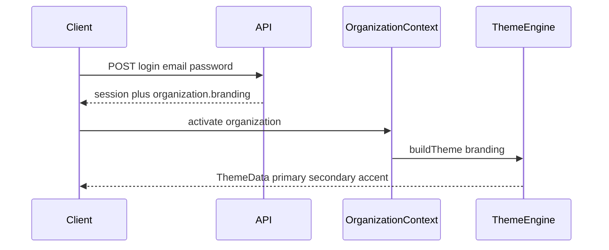

# Kiosk App — Branding & Theme API Contract

This document describes what the Flutter kiosk app expects from the **login** (and organization) API so the **entire app theme** updates after sign-in. No UI structure changes are required on the client when this contract is followed.

## Overview

1. Administrator calls `POST /auth/login` (or equivalent).
2. Response includes **organization branding** with color roles.
3. App builds `ThemeData` via `ThemeEngine` and applies it to `GetMaterialApp`.
4. On logout, theme resets to defaults.



## Recommended login response shape

Preferred: embed branding on the organization returned with login.

```json
{
  "session": {
    "token": "eyJ...",
    "refreshToken": "eyJ...",
    "organizationId": "palos"
  },
  "organization": {
    "id": "palos",
    "branding": {
      "organizationId": "palos",
      "displayName": "Palos Masjid",
      "logoRef": "https://cdn.example.org/palos/logo.png",
      "primaryColor": "#2E7D32",
      "secondaryColor": "#58BA47",
      "accentColor": "#81C784",
      "scaffoldBackgroundColor": "#F5F7FA",
      "donationUrl": "https://palosmasjid.org/donate"
    }
  }
}
```

### Alternative: nested `colors` object

Also supported inside `organization.branding` or at login root:

```json
{
  "session": { "token": "...", "refreshToken": "...", "organizationId": "palos" },
  "organization": {
    "id": "palos",
    "branding": {
      "organizationId": "palos",
      "displayName": "Palos Masjid",
      "colors": {
        "primary": "#2E7D32",
        "secondary": "#58BA47",
        "accent": "#81C784",
        "scaffoldBackground": "#F5F7FA"
      }
    }
  }
}
```

### Alternative: ARGB integers

```json
"primaryColor": 4283215696
```

Flutter stores colors as **32-bit ARGB** (`0xAARRGGBB`). Example: green `#2E7D32` → `0xFF2E7D32` → `4283215696`.

## Field reference

| Role | JSON keys accepted (any one) | Used for |
|------|------------------------------|----------|
| Primary | `primaryColor`, `primary_color`, `primary` | Sidebar, buttons, app bar, links |
| Secondary | `secondaryColor`, `secondary_color`, `secondary` | Accents, secondary buttons |
| Accent | `accentColor`, `accent_color`, `accent` | Tertiary highlights |
| Scaffold background | `scaffoldBackgroundColor`, `scaffold_background_color`, `scaffoldBackground` | Page background |
| Display name | `displayName`, `display_name` | Header title |
| Logo | `logoRef`, `logo_ref`, `logo` | Header logo (URL or asset path) |
| Donation URL | `donationUrl`, `donation_url` | Sidebar QR code |

All color fields are **optional**. Missing values fall back to documented app defaults (`KioskColors`).

## Color format rules

| Format | Example | Notes |
|--------|---------|--------|
| Hex string | `"#2E7D32"` | Preferred for readability |
| Hex string (no `#`) | `"2E7D32"` | Treated as RGB; alpha `FF` added |
| ARGB int | `4283215696` | Must include alpha channel |
| Hex int literal | `0xFF2E7D32` | Parsed as integer |

## What the app does **not** require

- Separate “get theme” call after login (branding may be included in login or cached after first load).
- Changing widget layout or screen structure.
- Per-screen color overrides from the API (one theme per organization is enough).

## Session restore

On cold start, the app restores `session` from local storage and reloads cached `BrandingProfile` for `organizationId`. Backend should keep branding stable per organization id.

## Demo accounts (offline)

| Email | Password | Primary (approx.) |
|-------|----------|-------------------|
| `admin@palos.org` | `palos123` | Green `#2E7D32` |
| `admin@annoor.org` | `annoor123` | Blue `#1565C0` |

## Validation checklist for backend

- [ ] Login returns `session.organizationId` matching `organization.id`
- [ ] `organization.branding.organizationId` matches `organization.id`
- [ ] `displayName` is non-empty
- [ ] At least `primaryColor` (or `colors.primary`) is set for tenant theming
- [ ] Colors use hex strings or ARGB ints consistently
- [ ] `logoRef` is HTTPS URL or omit for default placeholder
- [ ] `donationUrl` is HTTPS or omit (sidebar QR shows unavailable state)

## Example error-free minimal payload

```json
{
  "session": {
    "token": "t",
    "refreshToken": "r",
    "organizationId": "tenant-1"
  },
  "organization": {
    "id": "tenant-1",
    "branding": {
      "organizationId": "tenant-1",
      "displayName": "Community Center",
      "primaryColor": "#1D213E",
      "secondaryColor": "#3D4A7A",
      "accentColor": "#F28544"
    }
  }
}
```

## Client implementation references

- Model: `lib/app/core/data/models/branding_profile.dart`
- Color parsing: `lib/app/core/data/models/branding_color_parser.dart`
- Theme build: `lib/app/core/services/theme_engine.dart`
- Login activation: `lib/app/modules/auth/auth_service.dart` → `OrganizationContext.activate`
- App root theme: `lib/main.dart` (`GetMaterialApp.theme` from `OrganizationContext.theme`)

## Questions for backend team

1. Will colors live on `organization.branding` or a separate `GET /organizations/{id}/branding`?
2. Will you standardize on hex strings or ARGB integers?
3. Are there tenants with dark-mode palettes (app currently uses `Brightness.light` only)?
